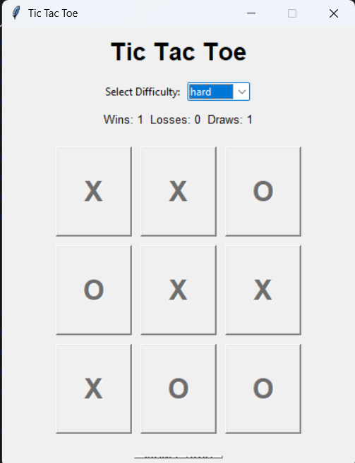

# 🎮 Tic Tac Toe AI

A desktop-based **Tic Tac Toe** game developed using **Python** and **Tkinter**, featuring an interactive graphical user interface (GUI) and an AI opponent with three difficulty levels. The project demonstrates game logic implementation, GUI development, and the **Minimax Algorithm** for optimal AI decision-making.

---

# 📌 Features

* 🎨 Interactive GUI built with Tkinter
* 🤖 Human vs Computer gameplay
* 🎯 Three AI difficulty levels:

  * Easy (Random Moves)
  * Medium (Random + Minimax)
  * Hard (Minimax Algorithm)
* 🏆 Automatic win, loss, and draw detection
* 📊 Live scoreboard for Wins, Losses, and Draws
* 🔄 New Game button to restart the game
* ⚡ AI move delay for a more natural gameplay experience
* 🧠 Unbeatable AI in Hard mode

---

# 🛠️ Technologies Used

* Python 3.x
* Tkinter
* Random
* Math

---

# 📂 Project Structure

```text
TicTacToe/
│
├── tic_tac_toe.py
├── README.md
```

---

# 🚀 Getting Started

## Prerequisites

* Python 3.x installed on your system

You can verify your installation by running:

```bash
python --version
```

---

## Clone the Repository

```bash
git clone https://github.com/saicharan-r02/tictactoe-game
```

Move into the project folder:

```bash
cd tictactoe
```

---

## Run the Application

```bash
python tic_tac_toe.py
```

The game window will open automatically.

---

# 🎮 How to Play

1. Launch the application.
2. Select a difficulty level.
3. The player always plays as **X**.
4. The computer always plays as **O**.
5. Click on an empty cell to place your move.
6. The AI responds automatically.
7. Continue until someone wins or the game ends in a draw.
8. Click **New Game** to start another match.

---

# 🤖 AI Difficulty Levels

## 🟢 Easy

* Computer selects moves randomly.
* Suitable for beginners.

---

## 🟡 Medium

* Combines Easy and Hard strategies.
* 50% chance of making a random move.
* 50% chance of using the Minimax algorithm.

This creates a balanced gameplay experience.

---

## 🔴 Hard

Uses the **Minimax Algorithm**, which evaluates every possible future game state before making a move.

The AI:

* Always chooses the optimal move.
* Wins whenever possible.
* Blocks the player's winning moves.
* Forces a draw when winning is impossible.

---

# 🧠 Minimax Algorithm

The Hard difficulty uses the **Minimax Algorithm**, a recursive decision-making algorithm widely used in turn-based games.

## Working Principle

1. Generate every possible legal move.
2. Simulate future game states recursively.
3. Evaluate terminal states:

   * AI Win = **10 − Depth**
   * Player Win = **Depth − 10**
   * Draw = **0**
4. Choose the move with the highest evaluation score.

Using depth-based scoring allows the AI to:

* Win in the fewest possible moves.
* Delay losing when defeat is unavoidable.
* Play optimally throughout the game.

---

# 📊 Score Tracking

The application keeps track of:

* ✅ Wins
* ❌ Losses
* 🤝 Draws

Scores are updated automatically after every completed game.

---

# 💡 Concepts Used

This project demonstrates several important programming concepts:

* Object-Oriented Programming (OOP)
* Event-Driven Programming
* Graphical User Interface Development
* Game State Management
* Recursive Algorithms
* Minimax Algorithm
* Decision Trees
* Score Tracking
* User Interaction Handling

---

# 🎯 Learning Outcomes

Through this project, I gained practical experience in:

* Building desktop GUI applications using Tkinter
* Implementing complete Tic Tac Toe game logic
* Designing an AI opponent
* Applying the Minimax Algorithm
* Using recursion for game-tree search
* Managing game states and events
* Writing modular and object-oriented Python code

---

# 🔮 Future Improvements

Potential enhancements include:

* Player vs Player mode
* Alpha-Beta Pruning for faster AI
* Dark Mode
* Sound Effects
* Game Timer
* Undo Move
* Winning Line Animation
* Save Score History
* Better UI Styling
* Custom Board Sizes (4×4, 5×5)

---

# 📄 License

This project is created for educational and learning purposes.

Feel free to use, modify, and improve the project.

---

# 👨‍💻 Author

**Sai Charan**

If you found this project useful, consider giving the repository a ⭐ on GitHub.


# Output


